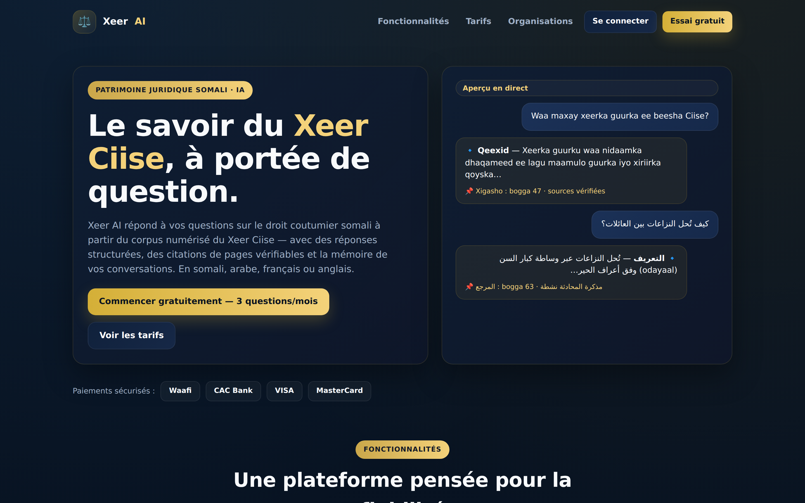
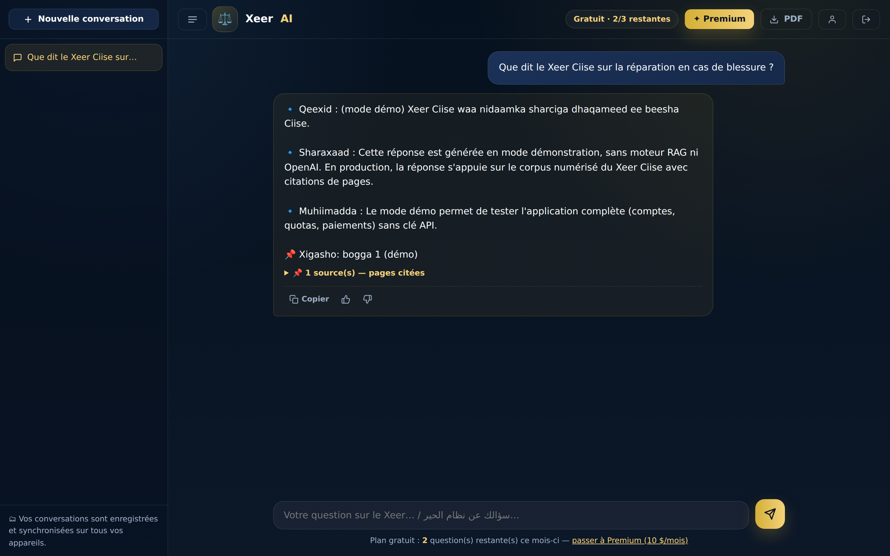
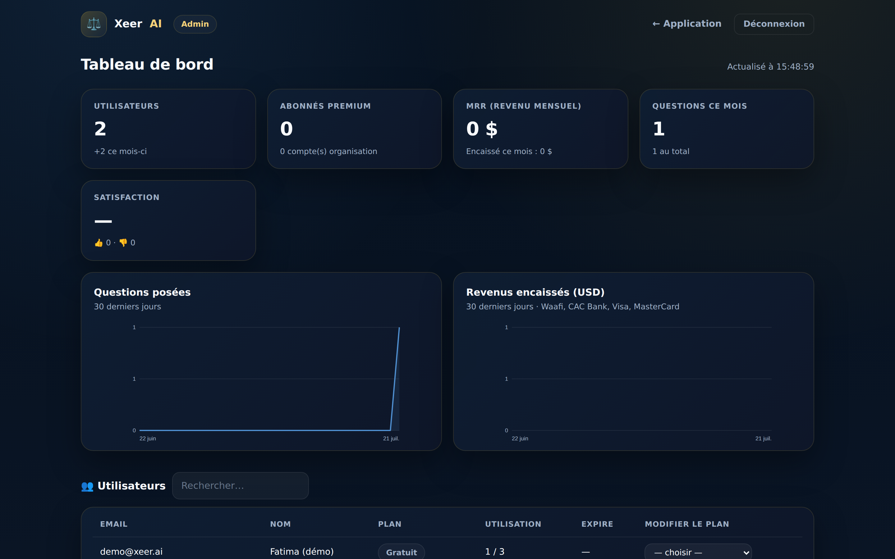

# Xeer AI


Assistant IA du **Xeer Ciise** (droit coutumier somali) — plateforme SaaS
complète : application web moderne (PWA installable + APK Android), comptes
utilisateurs, abonnements, paiements et tableau de bord administrateur.

## Démo en ligne

Déploiement « un clic » en **mode démo** (aucune clé OpenAI requise) :

**DigitalOcean App Platform** — [Déployer sur DigitalOcean](https://cloud.digitalocean.com/apps/new?repo=https://github.com/abomed95/xeer-ai/tree/main)
(spec : [`.do/app.yaml`](.do/app.yaml)). DigitalOcean lit le spec, construit
l'app et te fournit l'URL publique.

**Render** — [](https://render.com/deploy)
(spec : [`render.yaml`](render.yaml)). Colle l'URL du dépôt sur
https://render.com/deploy.

Les deux lancent toute la plateforme (comptes, quotas, paiements sandbox, admin)
sans clé ni index vectoriel, via le build léger
[`requirements-demo.txt`](requirements-demo.txt).

## Utilisation de Codex & GPT-5.5 (OpenAI Build Week)

<!-- NOTE ÉQUIPE : adaptez le paragraphe « Codex » à ce que vous avez réellement
     fait. Vérifiez aussi la version exacte du modèle utilisé (5.5 / 5.6). -->

**GPT-5.5 — le cœur du produit.** Le moteur de réponses de Xeer AI s'appuie sur
**GPT-5.5** via l'API OpenAI (`OPENAI_MODEL=gpt-5.5`). Dans le pipeline RAG, les
passages les plus pertinents du corpus numérisé du Xeer Ciise sont récupérés
(ChromaDB) puis fournis à GPT-5.5 avec une consigne stricte : s'appuyer
uniquement sur ces extraits et citer les pages sources. D'où des réponses
multilingues (somali, arabe, français, anglais), structurées et **vérifiables**.
Voir [`app/services/rag.py`](app/services/rag.py).

**Codex — assistant de développement.** Nous avons utilisé **Codex** (l'agent de
code d'OpenAI) pour concevoir et itérer sur le projet : backend FastAPI (auth,
quotas, billing, admin), moteur RAG, pipeline OCR et frontend PWA.

## Aperçu

| Landing | Chat (réponse citée) | Admin |
|---|---|---|
|  |  |  |

## Fonctionnalités

### Produit
- **Recherche sémantique** sur le corpus numérisé du Xeer Ciise (RAG)
- **Réponses structurées** avec citations de pages vérifiables
- **Historique de conversations** persisté en base, synchronisé sur tous les appareils
- **Feedback client** (👍/👎) sur chaque réponse, suivi dans l'admin
- **Multilingue** : somali, arabe, français, anglais
- **PWA installable** (web + mobile) et packaging **APK Android** (voir `docs/MOBILE_APK.md`)

### Abonnements
| Plan | Prix | Quota |
|------|------|-------|
| **Gratuit** | 0 $ | 3 questions / mois |
| **Premium** | **10 $ / mois** | Illimité |
| **Organisation** | Prix négociable (sur devis) | Personnalisé / illimité |

### Paiements
- **Waafi** (mobile money — Djibouti, Somalie, diaspora)
- **CAC Bank** (CAC Pay)
- **Visa** et **MasterCard** (passerelle carte bancaire)

Mode `sandbox` par défaut (paiements simulés de bout en bout) ; passez
`XEER_PAYMENTS_MODE=live` avec vos identifiants marchands pour la production.

### Administration (`/admin.html`)
- KPIs : utilisateurs, abonnés Premium, MRR, questions, revenus
- Graphiques 30 jours (questions posées, revenus encaissés)
- Gestion des utilisateurs et de leurs plans (dont quotas négociés)
- Suivi des paiements et des demandes de devis Organisation

## Démarrage rapide

```bash
pip install -r requirements.txt
cp .env.example .env          # renseignez OPENAI_API_KEY, XEER_SECRET_KEY…

# 1. Construire l'index vectoriel (une fois)
python scripts/build_vector_store.py

# 2. Lancer le serveur (API + frontend)
uvicorn app.main:app --reload
```

- Application : http://localhost:8000
- Chat : http://localhost:8000/app.html
- Admin : http://localhost:8000/admin.html (identifiants affichés au premier démarrage,
  ou définis via `XEER_ADMIN_EMAIL` / `XEER_ADMIN_PASSWORD`)
- Docs API : http://localhost:8000/docs

> **Mode démo** : `XEER_DEMO_MODE=1` permet de tester toute la plateforme
> (comptes, quotas, paiements sandbox, admin) sans clé OpenAI ni index vectoriel.

## Architecture

```bash
xeer-ai/
├── app/                      # Backend FastAPI
│   ├── main.py               # App, admin seed, statiques
│   ├── config.py             # Configuration (env)
│   ├── database.py           # SQLite (users, paiements, usage, leads)
│   ├── security.py           # PBKDF2 + jetons signés
│   ├── deps.py               # Auth / rôle admin
│   ├── routers/              # auth, chat, billing, admin
│   └── services/
│       ├── rag.py             # Moteur RAG (Chroma + OpenAI)
│       ├── accounts.py        # Plans, quotas, usage
│       └── payments/          # waafi, cacbank, card (Visa/MasterCard)
├── frontend/                 # Web (PWA)
│   ├── index.html             # Landing + tarifs + devis organisations
│   ├── app.html               # Chat (auth, quota, paiement intégré)
│   ├── admin.html             # Tableau de bord administrateur
│   ├── manifest.webmanifest   # PWA / APK
│   ├── sw.js                  # Service worker
│   └── assets/                # CSS, JS, icônes
├── scripts/                  # OCR, nettoyage, traduction, index vectoriel
├── data/                     # Corpus brut et nettoyé
└── docs/MOBILE_APK.md        # Générer l'APK Android
```

## Tech stack

Python · FastAPI · SQLite · ChromaDB · Sentence Transformers ·
OpenAI API (**GPT-5.5**) · PWA (vanilla JS) · OCR PyMuPDF + Tesseract
